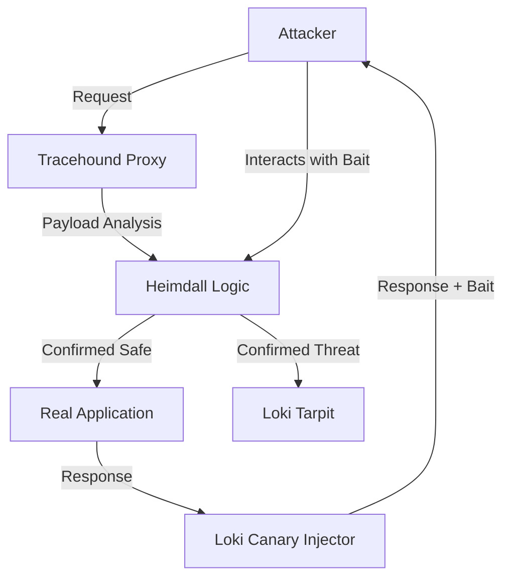

# RFC-0007: Loki — Passive Deception & Tarpit Layer

## 1. Summary

This RFC proposes **Loki**, a passive deception and resource-exhaustion layer acting as the "Anti-Tez" to Heimdall's detection logic. Unlike a high-interaction honeypot which incurs high compute costs, Loki operates as a **"Digital Mucosa"**—a sticky, low-cost layer designed to unmask malicious intent via static baits ("Canaries") and neutralize threats via protocol-level friction ("Tarpits").

## 2. Motivation: The Cost Asymmetry Problem

The previous iteration of Loki proposed "Active Illusion" (generating fake realities). This introduces two critical flaws:

1. **Inverse Resource Exhaustion**: Generating fake responses costs *us* CPU/RAM. A simple `while(true) curl` loop could DoS Tracehound by forcing it to simulate complex lies.
2. **Autoimmunity (False Positives)**: If a legitimate user is trapped in a simulation, trust is destroyed.

### The "Passive Defense" Paradigm

Tracehound provides **Immunity** (Identification & Elimination).
Loki provides **Biological Friction** (Mucus & Traps).
The goal is not to "hack back" or "simulate," but to **unmask** (via baits) and **stall** (via tarpits) with near-zero overhead.

## 3. Core Concepts

### 3.1 The "Digital Mucosa" (Zero-Cost Baits)

Instead of simulating fake endpoints, Loki injects static, invisible markers into valid responses. These are "Canaries."

* **Honeypot Headers**: Injecting `X-Admin-Debug-ID: <hash>` into headers. Normal clients ignore headers they don't know. Scrapers/Attackers log and try to exploit them.
* **Zombieland Fields**: Adding hidden form fields (e.g., `<input type="hidden" name="b_date_val" ...>`) to HTML responses. Browsers don't auto-fill these. Bots do.
* **Detection**: Interaction with any Canary is a **100% Confidence Signal** of non-human/malicious behavior. No heuristics needed.

### 3.2 The "Tarpit" (Protocol-Level Friction)

Once an actor is identified as hostile (via Heimdall or Canary interaction), Loki does **not** close the connection (RST). Closing the connection frees the attacker's resources to try again.
Instead, Loki engages a **Tarpit**:

* **TCP Zero-Window**: Telling the attacker "I received your packet, but my buffer is full, wait." The attacker's TCP stack will pause and hold the connection open, consuming *their* socket descriptors.
* **Slowloris Reversal**: Sending 1 byte of data every 15 seconds. Keeps the connection alive but useless.
* **Resource Asymmetry**: This is handled at the Kernel/Sidecar level (e.g., via `epoll` or async Rust runtimes), costing us bytes of RAM while consuming threads/processes on the attacker's side.

## 4. Architecture Integration

Loki sits within the `tracehound-proxy` as a low-level filter, post-Heimdall decision.

### 4.1 Integration with NOX

While Loki is the runtime defense, **Project NOX** serves as the "Laboratory." NOX generates the patterns of "Epistemic Chaos" to test if our Tarpits and Canaries are detectable or bypassable by sophisticated AI agents.

## 5. Strategic Value

* **Zero False Positives**: We rely on *intent-based* triggers (touching a hidden field), not statistical guessing.
* **Economic Damage**: We degrade the attacker's ROI by wasting their time and sockets.
* **Deterministic Safety**: No complex logic simulation. No hallucinations. Just static baits and protocol standards.

## 6. Risks & Mitigations

* **Risk**: Aggressive Parsers/Proxies accessing Canary Tokens.
  * *Mitigation*: Canaries must be strictly Non-Standard (e.g., `X-` headers) or standard-compliant but logically distinct (hidden inputs).
* **Risk**: Tarpit State Exhaustion (DoS on us).
  * *Mitigation*: Strict limits on Tarpit connections (e.g., Max 10,000 tarpitted sockets). If full, fallback to simplistic `DROP`.

## 7. Conclusion

Loki shifts from a "Fantasy Engine" to a "Flypaper Layer." It is consistent with Tracehound's engineering ethos: **High Efficacy, Low Overhead, Deterministic Execution.**
