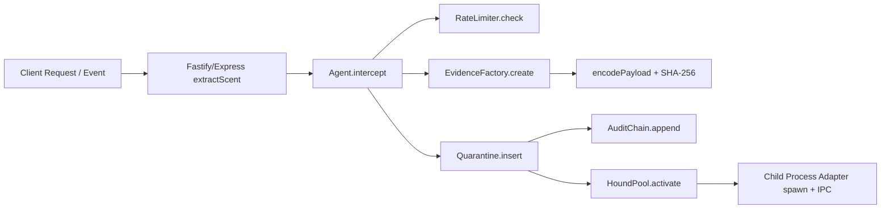

# Threat Model

## Scope

This model covers the open-source packages in this repository:

- `packages/core` (agent, quarantine, evidence lifecycle)
- `packages/fastify` and `packages/express` (request interception adapters)
- `packages/cli` (operator-facing inspection/status commands)

## Security Guarantee Envelope

Tracehound is modeled as a **deterministic security buffer**. Security guarantees are intentionally limited to:

1. **Deterministic evidence integrity** (canonicalization + hash/signature consistency)
2. **Parser and ingestion safety** (bounded + canonical handling of untrusted input)
3. **No unsafe execution from untrusted input** in supported runtime paths

## Non-Guarantees (Explicit)

- **Process separation is fault containment, not a hard security boundary.**
- **Quarantine is logical state isolation, not OS-level isolation.**
- **No sandbox guarantee** is made by application code alone.
- **Host compromise / container escape** is out of scope for app-layer guarantees.
- Deployment hardening (seccomp/AppArmor/non-root/network policy) is recommended operationally, but not required for logical correctness of the core security model.

## System Model

### Assets

1. **Evidence integrity** (hash/signature determinism)
2. **Quarantine correctness** (no bypass for `scent.threat` flows)
3. **Availability** (bounded memory/queue/timeout behavior)
4. **Auditability** (append-only audit chain records)

### Trust Boundaries

- **Inbound request boundary**: Fastify/Express request object → `Scent`
- **Detector boundary**: `Scent.threat` is external input; Tracehound does not classify threats itself
- **Process boundary**: core process ↔ hound child process (`spawn` + IPC)
- **Storage boundary**: quarantine in-memory state and optional cold storage integration

The trust boundary model and defaults are implemented in `trust-boundary.ts` and should remain conservative by default.

## Data Flow (High Level)

## Attacker Profiles

1. **Remote unauthenticated attacker**: sends crafted HTTP payloads to trigger bypass or DoS.
2. **Malicious integration input**: injects malformed `Scent` or untrusted detector output.
3. **Environment-level adversary**: abuses process spawning/OS capability assumptions.

## Key Assumptions (Audit Alignment)

- Runtime flags and process separation reduce risk, but are not treated as sandbox guarantees.
- Deterministic serialization + hash path remains stable for equivalent inputs.
- External hardening controls are deployment concerns, not core correctness claims.

## Deliverables for This File

- [x] System model and trust boundaries documented
- [x] Data flow captured
- [x] Per-boundary threat scenarios with test evidence links (`security/artifacts/threat-scenarios.md`)
- [x] Threat prioritization matrix (Likelihood x Impact) in `security/artifacts/threat-prioritization-matrix.md`
